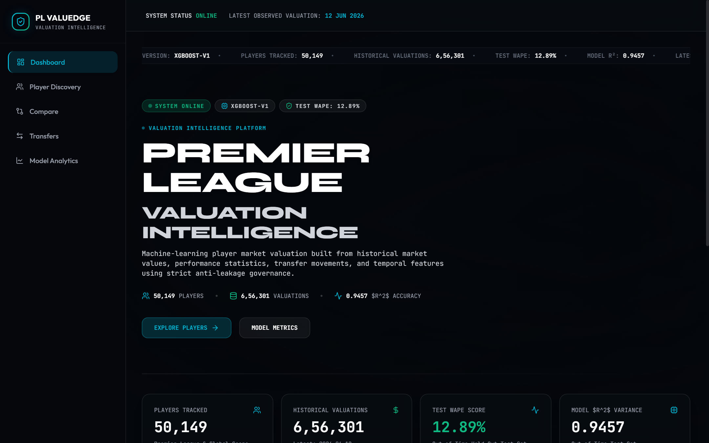
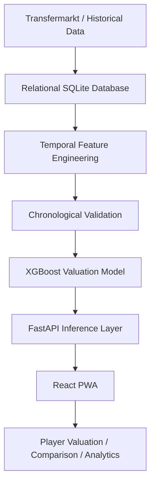
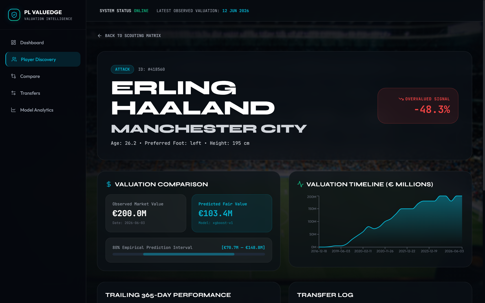
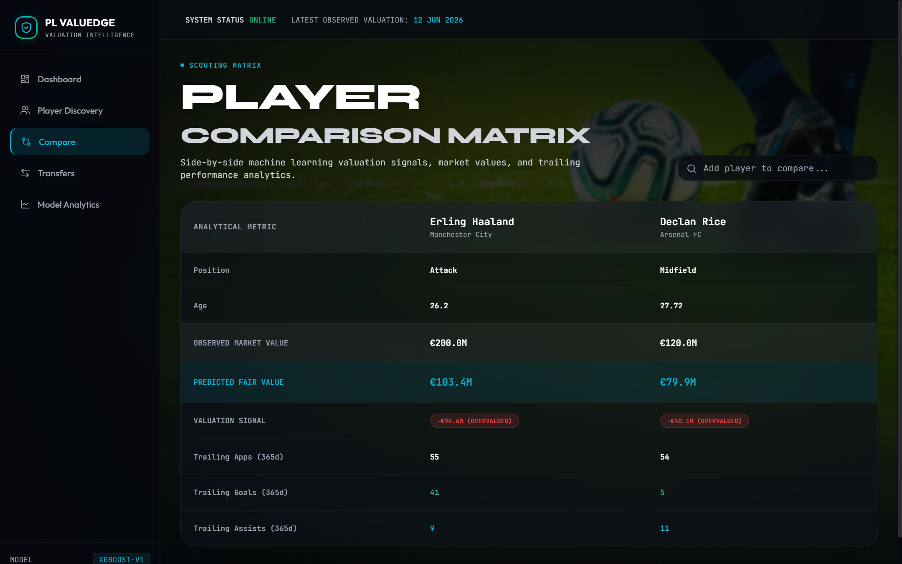
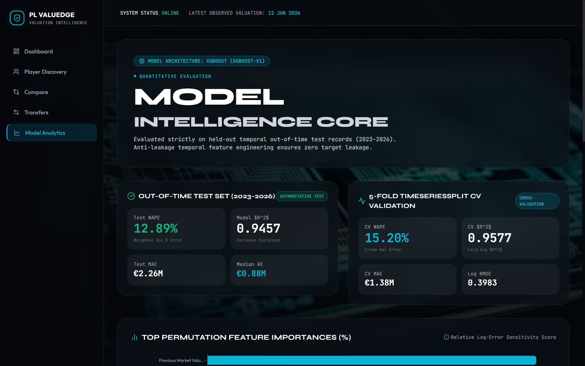

# PL ValuEdge — Premier League Valuation Intelligence

> **Production Machine Learning Valuation Terminal & Financial Analytics Engine**  
> *Algorithmic fair value estimation, empirical uncertainty quantification, and transfer intelligence for professional football.*

[](https://fastapi.tiangolo.com/)
[](https://react.dev/)
[](https://xgboost.readthedocs.io/)
[](https://www.sqlite.org/)
[](.github/workflows/ci.yml)
[](backend/tests/)

[Live Application Demo](https://ganeshancs.github.io/premier-league-valuation/) • [Backend API Service](https://pl-valuedge-backend.onrender.com) • [Interactive API Docs](https://pl-valuedge-backend.onrender.com/docs)

---

## 1. Product Visual


*PL ValuEdge Terminal Dashboard — Real-time squad market valuation monitoring, player signal distribution, and model valuation anomaly discovery.*

PL ValuEdge is a quantitative valuation terminal that computes algorithmic fair value baselines and 80% empirical prediction intervals for professional football players. The platform identifies market valuation anomalies across Premier League squads using historical valuation trajectories and trailing performance data.

---

## 2. The Problem

Association football transfer markets regularly exhibit pricing inefficiencies: speculative inflation, short-term tournament recency bias, media hype, and club brand markups. Traditional scouting lacks quantitative valuation benchmarks, while static crowd-sourced estimates fail to account for non-linear age curves, trailing performance decay, and market volatility.

Accurately determining player valuation requires modeling longitudinal valuation trajectories alongside trailing 365-day match statistics and contract liquidity under strict temporal anti-leakage constraints.

---

## 3. What It Does

- **Fair Value Prediction:** Real-time gradient boosted tree inference estimating predicted player market value in Euros (€) from 32 temporal features.
- **Uncertainty Bounds:** 80% empirical log-space residual prediction intervals ($p_{10}$ to $p_{90}$) providing realistic valuation floors and ceilings.
- **Player Discovery:** Filterable multi-attribute scouting matrix across leagues, clubs, age brackets, valuation ranges, and signal classifications (`UNDERVALUED`, `OVERVALUED`, `FAIR VALUE`).
- **Player Comparison:** Side-by-side comparative analytics for up to 6 players, evaluating valuation trajectories, performance metrics, and age curves.
- **Transfer Intelligence:** Tracking 175,000+ historical and future transfer movements, market liquidity, and fee-to-valuation premiums.
- **Model Analytics:** Interactive model governance exposing permutation feature importances, out-of-time test metrics, and residual error distributions.

---

## 4. How It Works



---

## 5. ML Engine

The valuation pipeline is designed to eliminate lookahead bias and model non-linear valuation dynamics:

- **Target Transformation:** The model predicts log-transformed market value: $y = \log(1 + \text{market\_value\_eur})$. This transformation stabilizes variance across orders of magnitude (€10K to €200M) and enforces positive monetary predictions via exponential back-transformation $\hat{V} = \exp(\hat{y}) - 1$.
- **Temporal Feature Engineering:** 32 strictly backward-looking features computed at valuation timestamp $t$:
  - *Valuation Trajectory:* `prev_market_value_eur`, `days_since_prev_val`, `val_count_prior`, `hist_max_value_eur`, `hist_min_value_eur`, `val_change_365d`, `val_growth_ratio_365d`.
  - *Trailing 365-Day Performance:* `apps_365d`, `starts_365d`, `minutes_365d`, `goals_365d`, `assists_365d`, `yellows_365d`, `reds_365d`, `goals_per90_365d`, `assists_per90_365d`, `contribs_per90_365d`.
  - *Career Cumulative Totals:* `career_apps_prior`, `career_minutes_prior`, `career_goals_prior`, `career_assists_prior`.
  - *Transfer Dynamics:* `prev_transfer_fee_eur`, `days_since_prev_transfer`, `total_prior_transfers`, `prev_transfer_fee_status`.
  - *Demographics & Role:* `age_at_valuation`, `age_squared`, `height_in_cm`, `main_position`, `sub_position`, `foot`.
- **Chronological Split:** The dataset is split chronologically to prevent temporal data leakage:
  - *Train (2015-07-01 to 2022-06-30):* 14,471 observations (1,525 unique players).
  - *Validation (2022-07-01 to 2023-06-30):* 3,151 observations (1,305 unique players).
  - *Out-of-Time Test (2023-07-01 to 2026-06-05):* 6,146 observations (1,043 unique players).
- **TimeSeriesSplit Validation:** 5-fold expanding window cross-validation evaluated across historical folds.
- **XGBoost Algorithm:** Gradient boosted decision trees optimized with `reg:squarederror` loss.
- **Uncertainty Intervals:** 80% empirical prediction intervals computed using test residual percentiles $[q_{0.10}, q_{0.90}]$ in log-space: $[\exp(\hat{y} + q_{0.10}) - 1, \exp(\hat{y} + q_{0.90}) - 1]$.
- **Explainability:** Permutation feature importance measures relative log error sensitivity across held-out observations: `prev_market_value_eur` (136.79%), `val_count_prior` (7.42%), and `prev_transfer_fee_eur` (3.19%) represent the primary valuation anchors.

---

## 6. Verified Model Results

Model performance evaluated on the held-out temporal out-of-time test set:

| Evaluation Window | Metric | Verified Value |
| :--- | :--- | :--- |
| **July 1, 2023 – June 5, 2026** | **Weighted Absolute Percentage Error (WAPE)** | **12.89%** |
| July 1, 2023 – June 5, 2026 | **Coefficient of Determination ($R^2$)** | **0.9457** |
| July 1, 2023 – June 5, 2026 | **Mean Absolute Error (MAE)** | **€2,255,249.92** |
| July 1, 2023 – June 5, 2026 | **Median Absolute Error (MedAE)** | **€877,417.50** |
| July 1, 2023 – June 5, 2026 | **Root Mean Squared Error (RMSE)** | **€4,950,696.25** |
| July 1, 2023 – June 5, 2026 | **Log RMSE** | **0.3457** |

*Note: In chronological validation experiments comparing Ridge Regression, ElasticNet, Random Forest, LightGBM, and XGBoost, tree-based gradient boosted models demonstrated superior non-linear modeling of performance and age trajectories over linear baselines, with XGBoost selected for production deployment.*

---

## 7. Product Walkthrough

| **Terminal Dashboard** | **Player Profile & Valuation Trajectory** |
| :---: | :---: |
| <br><sub>*Squad valuation aggregation, distribution analytics, and top undervalued/overvalued player discovery.*</sub> | <br><sub>*Historical valuation timeline, 80% empirical prediction interval bounds, and trailing match performance.*</sub> |
| **Multi-Player Comparison Matrix** | **Model Intelligence & Governance** |
| <br><sub>*Multi-player side-by-side scouting radar, valuation metrics, and comparative physical attributes.*</sub> | <br><sub>*Permutation feature importances, cross-validation metrics, and out-of-time residual error calibration.*</sub> |

---

## 8. Data & Scale

The production database is structured into a relational schema optimized with composite indexes:

| Entity | Record Count | Description |
| :--- | :--- | :--- |
| **Players** | `50,149` | Professional football player master records |
| **Clubs** | `1,852` | Global football clubs across all domestic tiers |
| **Valuations** | `656,301` | Longitudinal historical Transfermarkt valuation observations |
| **Transfers** | `175,165` | Historical and confirmed future transfer transaction records |
| **Appearances** | `1,894,348` | Match appearance events (minutes, goals, assists, discipline) |
| **Predictions** | `1,888` | Active model inference predictions with gap percentages and bounds |

*The uncompressed SQLite database (`pl_valuation.db`, ~378 MB) is acquired separately via an automated release download script and is intentionally excluded from Git tracking.*

---

## 9. Live Demo

- **Frontend Application (PWA):** [https://ganeshancs.github.io/premier-league-valuation/](https://ganeshancs.github.io/premier-league-valuation/)
- **Backend API Service:** [https://pl-valuedge-backend.onrender.com](https://pl-valuedge-backend.onrender.com)
- **API Health Endpoint:** [https://pl-valuedge-backend.onrender.com/api/health](https://pl-valuedge-backend.onrender.com/api/health)

> [!NOTE]
> The backend is hosted on Render's free tier. Inactive instances spin down automatically; initial requests may experience a cold-start delay (~50 seconds) while the container boots and validates the database.

---

## 10. Quickstart

### Prerequisites
- Python 3.10+
- Node.js 18+ and npm
- Git

### 1. Backend Setup
```bash
# Clone the repository
git clone https://github.com/GANESHANCS/premier-league-valuation.git
cd premier-league-valuation

# Create and activate virtual environment
python -m venv .venv
# Windows (PowerShell):
.venv\Scripts\Activate.ps1
# macOS/Linux:
source .venv/bin/activate

# Install backend dependencies
pip install -r requirements.txt

# Download and verify the production database (~105 MB gzipped)
python scripts/download_database.py

# Run API test suite (10 passed)
python -m pytest backend/tests/test_api.py -v

# Start FastAPI development server
uvicorn backend.app.main:app --reload --port 8000
```

### 2. Frontend Setup
```bash
# In a separate terminal, navigate to frontend
cd frontend

# Install Node dependencies
npm install

# Start Vite development server
npm run dev

# Build production bundle
npm run build
```

---

## 11. API Reference Overview

FastAPI provides automatic interactive OpenAPI documentation:
- **Swagger UI:** `http://127.0.0.1:8000/docs` (or via production endpoint)
- **ReDoc:** `http://127.0.0.1:8000/redoc`

| Route Group | Endpoint | Description |
| :--- | :--- | :--- |
| **Health** | `GET /api/health` | System status, model loading state, and database connectivity |
| **Dashboard** | `GET /api/dashboard/summary` | Aggregate valuation summary and top undervalued/overvalued players |
| **Players** | `GET /api/players` | Filterable player matrix (by league, club, position, valuation signal) |
| **Player Detail** | `GET /api/players/{id}` | Detailed player profile, physical attributes, and historical valuations |
| **Valuations** | `GET /api/players/{id}/valuation` | Algorithmic predicted fair value, signal, and 80% prediction interval |
| **Comparison** | `GET /api/players/compare` | Multi-player comparative vector (comma-separated `player_ids`) |
| **Transfers** | `GET /api/transfers` | Paginated transfer feed (`historical` and `future` scopes) |
| **Model Analytics** | `GET /api/model/analytics` | Model architecture, validation metrics, and feature importances |

---

## 12. Project Structure

```text
premier-league-valuation/
├── backend/
│   ├── app/
│   │   ├── api/             # FastAPI routers (dashboard, players, transfers, model)
│   │   ├── core/            # Configuration & settings (Pydantic V2)
│   │   ├── db/              # Database session & engine setup
│   │   ├── models/          # SQLAlchemy ORM entity models
│   │   ├── schemas/         # Pydantic validation schemas
│   │   └── services/        # Valuation engine & business logic
│   └── tests/               # Pytest API test suite
├── data/
│   └── processed/
│       └── ml/              # Model binary (best_model.joblib) & evaluation JSONs
├── docs/
│   └── screenshots/         # Verified UI screenshots
├── frontend/
│   ├── public/              # PWA manifest, service worker & icons
│   ├── src/
│   │   ├── api/             # API client & fetch wrappers
│   │   ├── components/      # UI components & charts
│   │   ├── pages/           # Application views
│   │   └── types/           # TypeScript API interfaces
│   └── vite.config.ts       # Vite build configuration
├── scripts/                 # Database acquisition and maintenance scripts
├── .github/
│   └── workflows/
│       └── ci.yml           # GitHub Actions CI pipeline
├── Dockerfile               # Production container definition
├── render.yaml              # Render blueprint deployment specification
├── requirements.txt         # Backend Python dependencies
└── README.md                # Project documentation
```

---

## 13. Tech Stack

| Domain | Technologies |
| :--- | :--- |
| **Backend** | FastAPI, Python, SQLAlchemy, Pydantic |
| **Machine Learning** | XGBoost, scikit-learn, pandas, NumPy, Joblib |
| **Frontend** | React, TypeScript, Vite, Tailwind CSS, Recharts, Framer Motion |
| **Database** | SQLite 3 |
| **Deployment** | GitHub Pages (Frontend) + Render (Backend Docker Container) |

---

## 14. Verification

- **Backend API Tests:** 10 passed (`python -m pytest backend/tests/test_api.py -v`).
- **Frontend Production Build:** 0 errors (`npm --prefix frontend run build`).
- **Continuous Integration:** Automated GitHub Actions workflow (`.github/workflows/ci.yml`) validating backend test suite and frontend typechecking/build on pull requests and pushes to `main`.

---

## 15. Project Status

The PL ValuEdge platform is fully implemented, verified, and deployed across GitHub Pages and Render. Model training, out-of-time evaluation, and API endpoints are functional and tested.

---

## 16. License

Licensing terms are not currently published.

---

## Disclaimer / Data Provenance

> **LEGAL NOTICE**  
> Premier League Valuation Intelligence (PL ValuEdge) is an independent quantitative portfolio analytics project created strictly for educational, research, and non-commercial analytical demonstration purposes.  
> It is not affiliated with, endorsed by, or sponsored by Transfermarkt, the Premier League, FIFA, UEFA, or any professional football club. All trademarked names and logos remain the property of their respective trademark holders.
